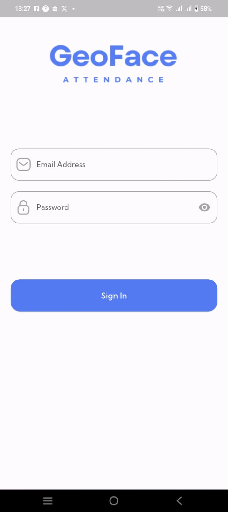
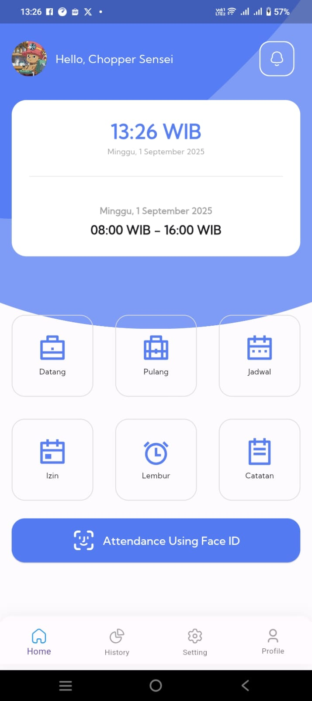
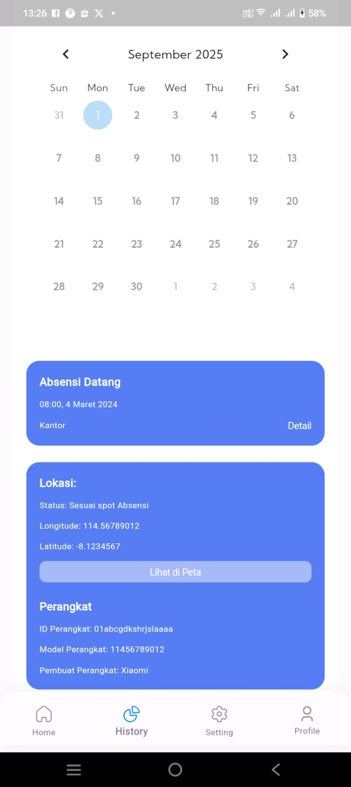

# 📱 Flutter Absensi App

Aplikasi absensi pegawai sederhana berbasis **Flutter & Dart** dengan backend **MySQL**.  
Project ini dibuat sebagai bagian dari pengalaman magang & portfolio untuk menunjukkan kemampuan saya dalam mengembangkan aplikasi mobile menggunakan Flutter dan integrasi dengan database.

---

## 📌 Features
- Login & Logout
- Check-in & Check-out absensi
- Attendance history
- Integrasi dengan MySQL melalui REST API

---

## 📌 Tech Stack
- Flutter (Dart)
- MySQL + REST API (Backend)
- Figma (UI Design)

---

## 📸 Screenshots
| Login | Home | History |
|-------|------|---------|
|  |  |  |

---

👤 **Author**: Indrany Apriliana Shanty  
- LinkedIn: [linkedin.com/in/indrany-apriliana](https://linkedin.com/in/indrany-apriliana)  
- GitHub: [github.com/indrany](https://github.com/indrany)
